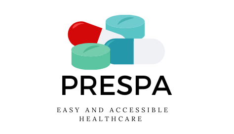
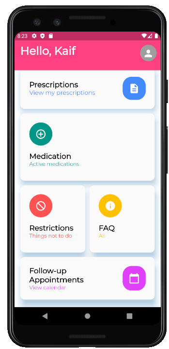
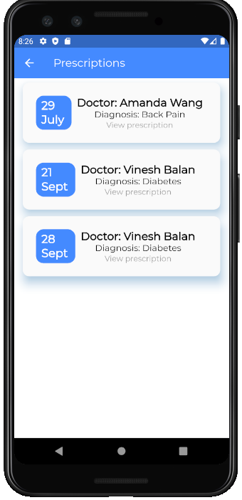

# Table of contents
1. [Introduction](#Prespa)
2. [Core Features](#Core-features)
3. [Integration with Hospitals](#Integration-with-hospitals)
4. [Key Technology](#Key-technology) 

# Prespa
Our goal is assist hospitals to provide a much more organised and positive patient experience. When a team mate shared her experience of trying the juggle the complex and vast of medical documents, prescriptions, restrictions imposed on both her parents, it became her responsibility to manage everything. We soon discovered that we were not alone in having such an experience and people across the globe have similar fructions about medical practicioners. 

We firmly believe, that care does not have to end when the patient has finished their consultation and left the hospital. With Prespa, we will ensure that patients truly understand and act upon their prescriptions, medications and restrictions given by their medical practionars. 

| Dashboard        | Medication list   | Prescriptions   |
| ------------- |:-------------:| -----:|
|     |  |  |

# How to run
* clone the repository
* install the flutter [sdk](https://flutter.dev/docs/get-started/install)
* run `flutter doctor` in terminal to check your flutter installation
* install [Android Studio](https://developer.android.com/studio/install)
* create an virtual Android device and run the app in Android Studio
* for testing, use the default login credentials: email admin@example.com password admin

# Core features 
- Enable patients to keep track of understand prescriptions. 
- Assist in understanding comflex instructions through dedicated sections. 
- Keep track of medications, their progression and provide additional knowledge about them.
- Assists with follow-up schedules if any. 

# Integration with hospitals
Our main customer are hospitals and we have developed a robust interface for them to input, monitor and respond to the patients needs. Hene we hav also developed a terminal interface fo the doctors. 

{Screenshot for doctor's interfact}

{Screenshot for API}

# Key technology

- Patient app: Flutter 
- Doctor's terminal: React.js 
- Authentication: Firebase 
- Database & API calls: Firebase
