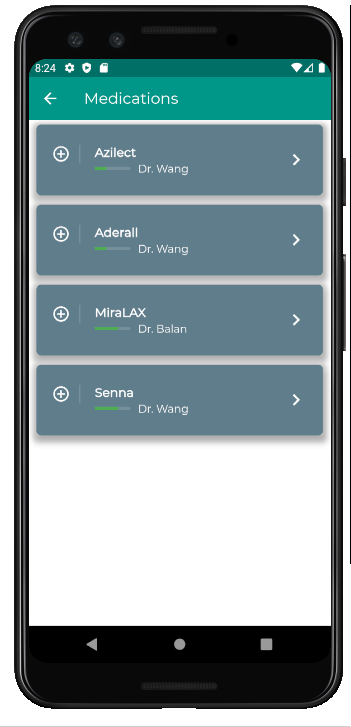

# Prespa
Our goal is assist hospitals to provide a much more organised and positive patient experience. When a team mate shared her experience of trying the juggle the complex and vast of medical documents, prescriptions, restrictions imposed on both her parents, it became her responsibility to manage everything. We soon discovered that we were not alone in having such an experience and people across the globe have similar fructions about medical practicioners. 

We firmly believe, that care does not have to end when the patient has finished their consultation and left the hospital. With Prespa, we will ensure that patients truly understand and act upon their prescriptions, medications and restrictions given by their medical practionars. 

| Tables        | Are           | Cool  |
| ------------- |:-------------:| -----:|
|     |  |  |